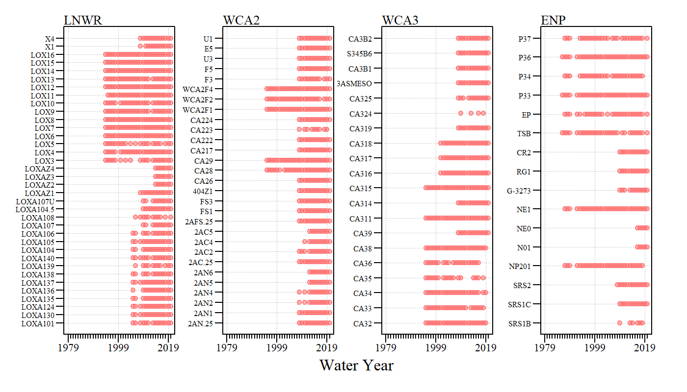

```{r setup, include=FALSE}
knitr::opts_chunk$set(echo = TRUE)
```


```{r,echo=FALSE,warning=FALSE,include=FALSE}
CurWY=2020
## Libraries
# Data Wrangling
library(AnalystHelper);
library(plyr);
library(reshape)

library(zoo)
# GIS libraries 
library(rgdal)
library(rgeos)
library(raster)
library(tmap)

# Data Vis
library(flextable)
library(magrittr)
library(xfun)
library(DT)

library(shiny)

export.path="C:/Julian_LaCie/_Github/EvergladesMarshTrends/Exports"
GIS.path="C:/Julian_LaCie/_GISData"


# Helper variables
nad83.pro=CRS(SRS_string = "EPSG:4269")
utm17=CRS(SRS_string ="EPSG:26917")

tmap_mode("view")


## Station List
station.list.LNWR=data.frame(Station.ID=c(paste0("LOXA",c(101,130,124,135:140,104:108,"104.5","107U","Z1","Z2","Z3","Z4")),
                                     paste0("LOX",3:16),"X1","X4","Z1"),
                             Region="LNWR")
station.list.LNWR$alias=station.list.LNWR$Station.ID
station.list.LNWR$alias=with(station.list.LNWR,ifelse(alias=="Z1","LOXAZ1",as.character(alias)))

station.list.wca2=data.frame(Station.ID=c(paste0("2AN",c(".25",1,2,4,5,6)),
                                          paste0("2AC",c(".25",2,4,5)),
                                          "2AFS.25","FS1","FS3","404Z1",
                                          paste0("CA2",c(6,8,9,17,22:24)),
                                          paste0("WCA2",c("F1","F2","F4")),"F3","F5","U3","E5","U1"),
                             Region="WCA2")
station.list.wca2$alias=station.list.wca2$Station.ID

station.list.wca3=data.frame(Station.ID=c(paste0("CA3",c(2:6,8:9,11,14:19,24:25)),
                                          "3ASMESO","CA3B1","S345B6","CA3B2"),
                             Region="WCA3")
station.list.wca3$alias=station.list.wca3$Station.ID

station.list.ENP=data.frame(Station.ID=c(paste0("SRS",c("1B","1C",2)),
                                         "NP201","N01","NE0","NE1","G-3273","RG1","CR2","TSB","EP",
                                         paste0("P",c(33,34,36,37))),
                            Region="ENP")
station.list.ENP$alias=station.list.ENP$Station.ID

station.list=rbind(station.list.LNWR,station.list.wca2,station.list.wca3,station.list.ENP)

station.list2=subset(station.list,Station.ID!="Z1")
station.list2$id.val=1:nrow(station.list2)

# GIS Data ----------------------------------------------------------------
db.path=paste0(GIS.path,"/SFER_GIS_Geodatabase.gdb")

wmd.mon=spTransform(readOGR(paste0(GIS.path,"/SFWMD_Monitoring_20200221"),"Environmental_Monitoring_Stations"),wkt(utm17))
wmd.mon=subset(wmd.mon,ACTIVITY_S=="Surface Water Grab")
evpa=spTransform(readOGR(db.path,"EPA_Boundary"),wkt(utm17))
# wca=spTransform(readOGR(db.path,"WCAs"),wkt(utm17))
# enp.shore=spTransform(readOGR(db.path,"Shoreline_ENPClip"),wkt(utm17))
# epa.sites=subset(wmd.mon,STATION%in%station.list$Station.ID)

```


Updated: `r paste(format(Sys.Date(),"%B %d, %Y"))`

***

Data used in this analysis was retrieved from the South Florida Water Management District online environmental database ([DBHYDRO](https://www.sfwmd.gov/dbhydro){target="_blank"}). (Site list can be downloaded here (as `.xlsx` or `.csv`) :

```{r,echo=F,warning=FALSE,message=FALSE}
library(downloadthis)

station.list%>%
  download_this(
    output_name = "SiteList",
    output_extension = ".csv",
    button_label = "Download dataset as .csv",
    button_type = "info",
    has_icon = TRUE,
    icon = "fa fa-file-alt"
  )

station.list%>%
  download_this(
    output_name = "SiteList",
    output_extension = ".xlsx",
    button_label = "Download dataset as .xlsx",
    button_type = "primary",
    has_icon = TRUE,
    icon = "fa fa-file-excel"
  )

```

### [`r paste(fontawesome::fa("github"),"Source Code")`](https://github.com/owper-tech/EvergladesMarshTrends){target="_blank"}

* GitHub repo [https://github.com/owper-tech/EvergladesMarshTrends](https://github.com/owper-tech/EvergladesMarshTrends){target="_blank"}

***


The information presented here, in part, is also published in the [South Florida Environmental Report](https://www.sfwmd.gov/science-data/scientific-publications-sfer){target="_blank"} annually and used to inform technical staff and policy makers on the status of the Everglades Ecosystem. This report uses publically available data to evaluate long-term trends in water column total phosphorus (TP) concentrations within the Everglades Protection Area.

This information presents the annual total phosphorous (TP) trends for all available data  for Water Years `r paste(1979,CurWY,sep=" - ")` (`r paste0("WY",1979," - ","WY",CurWY)`; May 1, `r 1978` –April 30, `r CurWY`) across the Everglades Protection Area (EPA) using annual trend analyses. The EPA includes the Arthur R. Marshall Loxahatchee National Wildlife Refuge (LNWR; also known as Water Conservation Area [WCA] 1), WCA 2, WCA 3, and Everglades National Park (ENP). 

## Data

Total phosphorus, and where available orthophosphate, data were retrieved from the South Florida Water Management District online environmental database ([DBHYDRO](https://www.sfwmd.gov/dbhydro){target="_blank"}) from marsh monitoring locations (Fig 1) between May 1, 1979 and April 30, `r paste(CurWY)`. Data reported less than the minimum detection limit (MDL) where set to one-half the MDL. Data were screened consistent with the Everglades TP rule screening protocol presented below.

```{r map, out.width="100%",fig.align='center', echo=FALSE,warning=FALSE, message=FALSE,fig.cap="Figure 1. Marsh water quality monitoring locations within the Everglades Protection Area"}
tm<-tm_basemap(leaflet::providers$Esri.WorldImagery,alpha=0.9)+
  tm_shape(evpa,name="Everglades Protection Area")+tm_borders(col="red",alpha=0.5,lwd=2)+
  tm_shape(subset(wmd.mon,STATION%in%station.list$Station.ID),name="Monitoring Sites")+
  tm_dots(col="dodgerblue1",size=0.1)+tm_text("STATION",col="white",fontface=3,ymod=0.1)

tmap_leaflet(tm)
```


***

#### Data Screening Protocol

The information below specific to TP rule Data Quality Screening Protocols are included here for reference and is consistent with the quality assurance and quality control procedures described in the FDEP protocol available at [https://floridadep.gov/sites/default/files/data-quality-screening-protocol.pdf](https://floridadep.gov/sites/default/files/data-quality-screening-protocol.pdf){target="_blank"} (FDEP 2004).

Total phosphorus measurements utilized for purposes of assessing ambient water quality conditions shall be screened based on 

1. Sample collection depth, 
2. data qualifiers/comments, 
3. blank contamination, and 
4. reversals as described below to assure that the data is of adequate quality to accurately access the phosphorus status of a water body.

***Depth Screening***

Total phosphorus data shall not be collected at a station when the total depth at that station is less than 10 cm. Any data collected below this minimum depth shall be rejected for use.

***Data Qualifiers/Comments***

Data qualifiers for individual parameter results shall be checked for fatal remarks or comments that would necessitate the disqualification of the data. Any data qualified with a code of H, J, K, N, O, Q, Y, or ? as described in Chapter 62-160 of the Florida Administrative Code are rejected for use. Additionally, data with designated with a qualifier code of U or T are replaced with a value equal to one-half of the minimum detection limit (MDL) for that parameter. Further, field and laboratory comments that accompany the data are reviewed for any indication that the sample collected or the laboratory results are not representative of the true conditions (e.g., a comment indicating that the sample contained a large portion of sediment). Any data that are indicated not to be representative of the true conditions are also rejected for use. The remaining data are then evaluated for blank contamination.

***Blank Contamination***

A blank will be considered contaminated if the laboratory result is greater than the MDL (i.e., the parameter was detected). If any analytical result associated with a contaminated blank is less than 5 times the value of the contaminated blank, all the associated samples for that parameter for that sampling event shall be disqualified.

***Reversals***

The final step in the data screening protocol involves the evaluation of reversals within a sample. If a constituent (e.g., filtered parameter such as orthophosphate) and the total (e.g., total phosphorus) are both above the PQL (practical quantitation limit), the pair of values shall be disqualified if the constituent is more than 1.2 times the value of the total. If one or both of the pair are between the MDL and the PQL, a factor of 1.3 shall be used.

The Department/District shall note for the record any data that are excluded and provide details concerning the reasons for excluding these data. Data passing the screening protocol described herein shall be deemed of acceptable quality for purposes of assessing ambient conditions within the water body; however on an annual basis any station with fewer than 6 screened monthly values shall not be utilized in the assessment

***

#### Analysis

Annual (WY) geometric mean concentrations were calculated for WYs with greater than or equal to 6 samples per year and at least one sample in the wet (May - October) and dry (November - April) seasons. Temporal trend analysis was performed on annual geometric mean concentration across the study are using Kendall’s $\tau$ correlation analysis and Thiel-Sen slope estimate (`zyp` R-package; Bronaugh and Werner 2013). Kendall seasonal trend test was considered however, due to the conditions that limit sampling some monitoring locations have data gaps during the year thereby affecting the representativeness and heterogeneity of the season. 

<!--For visualization purposes, Thiel-Sen slope and average AGM concentrations were spatially interpolated using thin-plate spline interpolation (`fields` R-package; Nychka et al. 2017) and clipped to the study area. -->

Thiel-Sen slope value and slope 95% confidence intervals are presented in addition to the annual Kendall trend results and `r "\u03C1-value"`. When evaluating site specific trend results, waiting for a slope to be considered significant based on a selected `r "\u03C4-value"` can increase management response time to a system that is likely experiencing significant shifts in water quality as suggested by Milliette et al. (2019).

All statistical operations were performed with R (Ver 3.6.3, R Foundation for Statistical Computing, Vienna Austria). Unless otherwise stated, all statistical operations were performed using the base R library. The critical level of significance was set at $\alpha$ = 0.05.

## Data Inventory

For most of the monitoring locations, routine sampling did not initiate till the late 1999s. As restoration continued and monitoring for other mandates was needed the monitoring network expanded. The region with the longest period of record was ENP with monitoring starting in WY1986 (Fig 2). 

```{r,echo=F,fig.align='center', out.width='80%',fig.cap=paste0("Figure 2. Monitoring inventory with suitable number of samples (total samples \u2265 6, one in wet and dry season) throughout the period of record.")}

```

```{r,echo=F}
ann.kendall=read.csv(paste0(export.path,"/ann_kendall.csv"))

```

## Results

<br>
Generally, TP concentrations generally exhibited a general north-to-south (spatial) concentration gradient. During the current period of record, `r nrow(subset(ann.kendall,tau<0&pval<0.05))` of the `r nrow(ann.kendall)` monitoring locations across the EPA exhibited significantly declining trends with Thiel-Sen slopes ranging from `r format(round(min(subset(ann.kendall,tau<0&pval<0.05)$slope),2),nsmall=2)` to `r format(round(max(subset(ann.kendall,tau<0&pval<0.05)$slope),2),nsmall=2)` `r "\u03BCg L\u207B\u00B9 WY\u207B\u00B9"` (Table 1 and Fig 3). Conversely, `r if(nrow(subset(ann.kendall,tau>0&pval<0.05))<10){numbers_to_words(nrow(subset(ann.kendall,tau>0&pval<0.05)))}else{nrow(subset(ann.kendall,tau>0&pval<0.05))}` monitoring location exhibited significantly increasing trends. However, several monitoring locations (`r nrow(subset(ann.kendall,tau>0))` sites) exhibited increasing rates of change (positive Thiel-Sen slopes) with rates of change ranging from `r format(round(min(subset(ann.kendall,tau>0)$slope),2),nsmall=2)` to `r format(round(max(subset(ann.kendall,tau>0)$slope),2),nsmall=2)` `r "\u03BCg L\u207B\u00B9 WY\u207B\u00B9"`.

Stations specific annual trend results can be found in [Table 1](#tab1).

Station specific monthly and annual plots can be found in the [drop-down](#dataviz) menu below.

<br>

```{r,echo=F,fig.align='center', out.width='60%',fig.cap=paste0("Figure 3. Period of record trend results. Increasing/decreasing trends were evaluated based on Kendall's \u03C4-value at an \u03B1=0.05.")}
knitr::include_graphics(paste("Plots/WY",CurWY,"_TPTrendMap.png",sep=""))
```

<br>

***

<br>
<a name="tab1"></a>
<center>Table 1. Annual trend results for monitoring locations within the Everglades Protection Area. Results can be copied or exported (as `csv` or `xlsx`). </center>
<br>
```{r, echo=F,fig.align='center' }
ann.kendall$pval.txt=with(ann.kendall,ifelse(pval<0.01,"<0.01",format(round(pval,2),nsmall=2)))
ann.kendall$tau=round(ann.kendall$tau,2)
ann.kendall$slope=round(ann.kendall$slope,2)
ann.kendall$LCL=round(ann.kendall$LCL,2)
ann.kendall$UCL=round(ann.kendall$UCL,2)

ann.kendall=merge(ann.kendall,station.list,"alias")
ann.kendall=ann.kendall[,c("Region","alias","tau","pval.txt","slope","LCL","UCL","N.samp")]
ann.kendall=ann.kendall[order(match(ann.kendall$Region,c("LNWR","WCA2","WCA3","ENP")),ann.kendall$alias),]

library(DT)
font.size <- "10pt"

datatable(ann.kendall,filter="top",rownames = NA,escape=F,
          colnames=c("Region","Station","Kendall's<br>\u03C4","\u03C1-value","Thiel-Sen<br>Slope","Lower<br>CI","Upper<br>CI","N<br>(WYs)"),
          extensions="Buttons",
          options=list(
  dom="Bfrtip",
  buttons=c("copy","csv","excel"),
  columnDefs=list(list(className='dt-center',targets=2:7)),
   initComplete = htmlwidgets::JS(
          "function(settings, json) {",
          paste0("$(this.api().table().container()).css({'font-size': '", font.size, "'});"),
          "}")
))
```


***
<a name="dataviz"></a>

### Site Specific Trends

**Explaination**

Presented here are site specific TP concentration information. The plots are broken into monthly (left), annual (middle) and a map with the monitoring location identified (right). The top-left plot, shows the monthly distribution of TP concentrations from May to the following April (like the Florida Water Year) with individual samples presented in shaded gray relative to the period of record monthly mean concentration. The bottom-left plot is a box-and-whisker plot of monthly TP concentrations for the given site intended to represent the median (and inter-quantile range) of monthly TP concentrations within the period of record. The top-middle plot is the annual geometric mean TP concentration relative to the Thiel-Sen line (trend) with the `r "\u00B1"` 95% confidence interval and the average geometric mean concentration during the period of record. The bottom-middle plot is the annual TP anomalies plot, annual TP anomalies are defined as the difference of the annual geometric mean and the long term average geometric mean (i.e. period of record average annual geometric mean TP concentration). 

**Note:** If the lower 95% confidence interval has negative values it will not plot in the plots below due to the log-scale axis.

<br>
<!--
```{r,echo=F}
# https://walker-data.com/2016/12/rmd-dropdowns/
library(stringr)
library(bsselectR)

site_plots <- paste0(list.files("Plots/site_trend", full.names = TRUE))
names(site_plots) <- str_replace_all(site_plots, 
                                      c("\\.png" = "", 
                                        "Plots/site_trend/" = ""))

bsselect(site_plots, type = "img", selected = "LOXA101", 
         live_search = TRUE, show_tick = TRUE)

```
--->


#### Station {.tabset .tabset-dropdown}

```{r ,results='asis',echo=F}
wq.sites=unique(station.list2$alias)
for(i in 1:length(wq.sites)){
   cat('\n')
   cat("#####",wq.sites[i],"\n")
   
   # knitr::include_graphics(paste("Plots/site_trend/",wq.sites[i],".png",sep=""))
   ## known issue for 'include_graphics' to not work
   cat(paste0("","\n"))
   cat('\n')
  }
```

***

#### {- .leave-tabset}

## References

Bronaugh DB, Werner A (2019) Zhang + Yue-Pilon trends package. CRAN R-Project. [https://cran.r-project.org/web/packages/zyp/](https://cran.r-project.org/web/packages/zyp/){target="_blank"}. 


FDEP (2004) Data Quality Screening Protocol. Florida Department of Environmental Protection,
Tallahassee, FL. July 15, 2004. Available online at
[http://www.dep.state.fl.us/everglades/files/criterion_ScreeningProtocol.pdf](http://www.dep.state.fl.us/everglades/files/criterion_ScreeningProtocol.pdf){target="_blank"}.

Millette NC, Kelble C, Linhoss A, et al (2019) Using Spatial Variability in the Rate of Change of Chlorophyll a to Improve Water Quality Management in a Subtropical Oligotrophic Estuary. Estuaries and Coasts 42:1792–1803. doi: [10.1007/s12237-019-00610-5](https://link.springer.com/article/10.1007/s12237-019-00610-5){target="_blank"}
